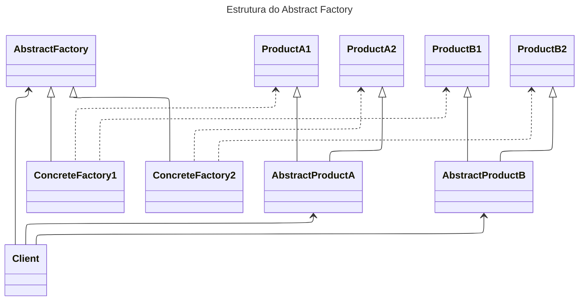

# Unique Identifier
202510240635

# Tag
#DesignPattern 

# Body
[[202510230627 - Design Patterns]]

O objetivo desse pattern é criar uma interface de criação de famílias de objetos relacionados/dependentes sem implementar as classes concretas.

É indicado quando:
- Um sistema de ser independente de como seus produtos são criados, compostos e representados
- O sistema deve ser configurado com segregação de **famílias de produtos**
- Os produtos de cada família devem ser usados juntos (deve ter uma trava para misturar classes de diferentes famílias)
- Os produtos devem ser expostos aos clientes por meio de uma class library revelando apenas as interfaces dos mesmos em implementação

Estrutura do Pattern

# Footer / Reference
[[REF - Desenvolvedor.io - Curso Arquitetura]]
https://www.dofactory.com/net/design-patterns
https://refactoring.guru/design-patterns
Design Patterns: Elements of Reusable Object-Oriented -> Cap 87