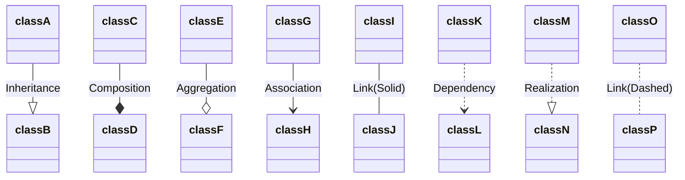

# Unique Identifier
202510251523

# Tag
#UML 

# Body
Notação útil para descrever classes. Por agora tudo que eu sei é o que o mermaid usa do class diagram.

# Footer / Reference
https://docs.mermaidchart.com/mermaid-oss/syntax/classDiagram.html#defining-relationship
